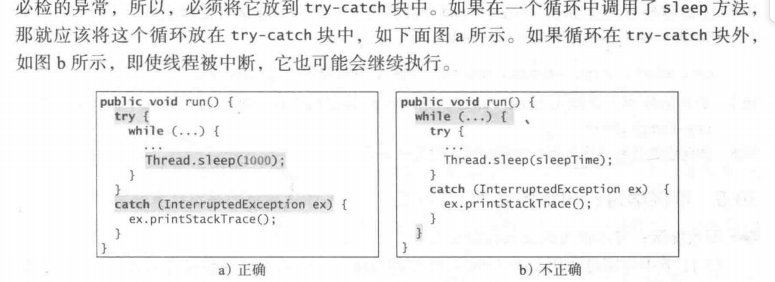

[TOC]


# JAVA基础

参考书 ：Java语言程序设计 基础篇 第11版（introduction to Java programming comprehensive version 11 edition）

## 一.程序设计基础

### 第一章 - 计算机、程序和Java概述

pass

### 第二章 - 基本程序设计

本章主要聚焦于Java与其他语言（诸如c，c++，python）的不同点

程序设计：解决问题的策略 + 应用编程语言实现策略

#### 1.程序入口：

Java 源程序文件名必须和程序中的公共类名一致，并且以扩展名 .java 结束

demo1.java:

```java
public class demo1{
	public static void main(String[] args){
        System.out.println("hello world");
    }
}

```

#### 2.输入输出

- 输出：

```java
System.out.print....
```

注意 ：源代码中字符串常量不能跨行 造成编译错误


- 输入：

java不直接支持控制台输入 用**Scanner** 的对象读取**System.in**的输入

```java
Scanner input = new Scanner(System.in);
```

创建一个Scanner对象并将其引用值赋给Scanner类型的变量input，调用对象的方法以读入控制台输入

```java
double num = input.nextDouble();
```

- 回车符标识输入结束

- 没有必要创建多个输入对象


#### 3.包导入

使用Scanner前需要先导入包：

```java
import java.util.Scanner;
```


- 明确导入

指定单个的类 如上式

- 通配符导入

*  -->导人一个包中所有的类

```java
import java.util.*
```


除非要在程序中使用某个类，否则关于被导人包中的这些类的信息在编译时或运行时是不被读入的。

导人语句只是告诉编译器在什么地方能找到这些类。声明明确导人和声明通配符导人在性能上是没有什么差别的

#### 4.命名常量

final  （ =  constant in c/c++）

#### 5.取整错误

 浮点数运算容易出现各种错误 因为浮点数不是精确存储的

整数可以精确的存储，故整数运算时正确的


### 第三章 - 选择

java 内置boolean数据类型

#### 1.条件跳转

if  / if - else / if - else if / swich case/条件表达式（ ... ? ... : ... ）

- 悬空else歧义：

else 优先匹配与之最近的if 除非

```java
if (..){
    if(..){
        
    }
}else{
    
}
//匹配第一个if
```

#### 2.运算操作

1. p1 &&p2 : Java 先求 p1 的值，
   1. 如果 p1 为 true, 再对 p2 求值；
   2. 如果 p1 为 false, 就不再对 P2 求值。&& 也称为条件与操作符或短路与操作符
2. p1 ll p2 ：Java 先求 p1 的值
   1. 如果 pi 为 false, 再对 p2 求值；
   2. 如果 p1为 true, 就不再对 p2 求值。||也称为条件或操作符或短路或操作符。

-  x = ...  赋值语句返回的是最终变量的值 

  

- 除开赋值操作符的所有二元搡作符都是左结合的，赋值操作符是右结合的

- 两个浮点数值相等的判断不一定可靠

- ？是这么说吗？若if语句后有return语句，则最后必须要加一个else？--- 貌似没事？

### 第四章 - 数学函数、字符和字符串

#### 1.Math类的方法

1. Math.pow(a,b) ---> 计算a的b次方
2. Math.random() ---> 产生随机数
3. Math.PI / Math.E ---> Π和e
4. 三角函数方法
5. 指数函数方法
6. 取证函数的方法
7. min() / max() / abs()

#### 2.字符与字符串

1. 转义序列  反斜杠

2. 字符类型与数值类型的转化

   1. int --> char 取低16位 其他舍去

   2. double --> char double先转int int再转char

   3. char --> int

   4. 隐式转换与显示转换

      当转换结果适用于目标变量可以隐式转化 ，若不适用则用显示转化进行强制赋值

      ```java
      byte b = '\u0008';
      //byte c = '\u0080';  报错 一个字节最大表示数为127，故该字符转化成字节类型不适用，故需要下式的显示转化
      byte c = (byte)'\u0080';
      
      byte d = '\u007f';
      System.out.println(b);
      System.out.println(c);
      System.out.println(d);
      
      //输出结果为：
      8
      -128
      127
      ```

      - 0 - FFFF 的任何一个十六进制正整数都可以隐式地转换成字符型数据。而不在此范围内的任何其他数值都必须显式地转换为char 型

      - 所有数值操作符都可以用在 char 型操作数上。如果另一个操作数是一个数字或字符，那么 char 型操作数就会被自动转换成一个数字
      - 字符比较  -- 通过比较字符的unicode编码实现
      - Character类含有用于字符测试的方法

#### 3.String 类

引用类型（非基本类型） --- > 引用变量 引用一个对象

##### 函数：

实例方法 （---静态方法） 只能通过实例对象来调用

- .length()
- .charAt(index) (从0开始算，越界抛出异常)
- .concat(s)  --- + / +=
- .toLowerCase() / .toUpperCase() / .trim()
-  == 相当于 .equals（）
- < <= > >= 会报错 用.compareTo


- Scanner next()方法读取字符串 空白字符标识结束
- Scanner nextLine() 读取一整行文本 回车标识结束
- nextLine() + charAt(0) 读取字符


 字符串和数字之间的转换

- Integer.parseInt(string)
- Double.parseDouble(string)
- string非数字会报错


### 第五章 - 循环

pass

### 第六章 - 方法

基础pass 

在类内定义，不需要在将函数体放在调用处的前面或使用前声明

#### 方法抽象和逐步求精


### 第七章 - 一维数组

#### 数组变量：

- 声明数组变量

```java
elemtType[] arrayRefvar;  //java风格
elemtType arrayRefVar[];  //c++风格 不推荐
```

声明一个数组变量时并不分配内存空间

创建了 **对数组的引用**的存储位置 如果该变量不包含对数组的引用，那么这个变量的值为**null**

- 创建数组

  ```java
  arrayRefVar = new elementType[arraySize];
  ```

  1. 创建了一个数组
  2. 将这个数组的 **引用** 赋值给变量arrayRefVar

- example:声明与创建一起

```java
double[] myList = new double[10];
```

- 一个数组变量和一个数组是不同的

  多数情况下差别可以忽略

  **数组变量** 存储的是指向 **数组** 的引用

- 大小固定，默认值为： 0 /  \u0000 / false...

- 通过下标访问数组元素 
- 初始化：

```java
double[] myList = {1.9, 2.9, 3.4, 3.5};//不使用new运算符

//上式等价于下式

double[] myList = new double[4];
myList[0] = 1.9;
myList[1] = 2.9;
myList[2] = 3.4;
myList[3] = 3.5;
```


#### 处理数组：

- for-each 循环 （c++ 风格）

  ```java
  for (double e: myList){
      //操作e
  }
  ```

- 注意数组越界，会抛出异常

- 数组复制

  1. 使用循环语句逐个复制

  2. System类的静态类 arraycopy

     ​	不给目标数组分配内存空间，复制前需创建目标数组并分配内存空间。

     ​	复制完成后，两数组有相同的内容，但占有独立的内存空间

     ​	arraycopy 不符合java命名习惯

  3. clone 方法
  
  4. 注意：

```java
list2 = list1;
//该语句并不是将list1里面的数据复制到list2
//list2 指向list1数组 原本list2指向的数组被jvm自动回收（垃圾回收）

```

- 将数组传递给方法

  ​	传递的是数组的引用	

  ​	....functionName (... , int[] array ){......}

  - 匿名数组

  ```java
   new int[]{values....}
  
  //没有显式的引用变量 常用于函数调用时传参
  ```

  - java基本参数类型参数是值传递，数组是引用（共享信息） **理解这个数组在函数内进行操作的过程**
  - 数组在 Java 中是对象。JVM 将对象存储在一个称作堆(heap)的内存区域中，堆用于动态内存分配

- 从方法中返回

  返回的是数组的引用

  int[] functionName(){... return array}

- 可变长参数列表

  函数传参：同样类型/数目可变--->将作为数组对待

  只能给方法指定一个可变长参数，同时该参数是最后一个参数

  ....functionName(type... name)

  可以传入数组，也可以传入一系列参数（java将创建一个包含这些参数的数组）

  

  


#### 数组算法：

##### 查找：

- 线性查找

取数组中的每一个元素进行比较，效率不高


- 二分查找

若已排好序，二分查找比线性查找更高效

时间为O（logN）


java实现： 

不要急于给出一个完整的实现，要进行逐步的时间

在arr中找key，arr递增

1. 考虑第一次迭代
2. 考虑循环，进行重复
3. 考虑结果
   1. 找到了返回结果
   2. 没找到返回－1？
      - 想要将key插入arr中怎么办?
      - low就是一个插入点


##### 数组查找


#### Arrays类

java.util.Arrays

1. 排序与查找

   - ```java
     java.util.Arrays.sort(new double[] {......})
     ```

   - ```java
     java.util.Array.sort(array,1,3);//array[1] --- array[3-1]
     ```

   - ```java
     //binary search 必须提前升序排好
     java.util.Arrays.binarySearch(array,'..');
     ```

2. 其他方法

   - 比较数组

     ```java
     java.util.Arrays.equals(array1,array2);
     ```

   - 填充数组

     ```java
     java.util.Arrays.fill(array,'context');
     ```

   - 填充数组

     ```java
     java.util.Arrays.fill(array,start,end,'context');
     ```

   - 数组转字符串

   

#### 命令行参数


### 第八章 - 多维数组


## 二.面向对象程序设计

### 第九章 - 类和对象

面向对象编程  ---- 大型软件 和 图形用户界面

#### 为对象定义类

- 类为对象定义 **属性** 和 **行为**
- 类是一个模板，对象是类的实例
- java 使用变量定义数据域，用方法定义动作
- 类的构造方法 --- 为了完成对象的初始化操作

#### 使用构造方法构造对象

new 操作符 调用构造方法创建对象

##### 构造方法

1. 与类名相同
2. 可以重载
3. 不能用void类似的前缀修饰
4. 声明为public

#### 通过引用变量访问对象

新创建的对象在内存中被分配空间，他们可以通过引用变量来访问

.操作符通过对象的引用变量访问对象的数据和方法


- 类是一种引用类型，该类型的变量可以引用该类的一个实例

- 引用变量包含了对对象的引用


- 对象成员访问操作符  .  
- 匿名对象 -- 只创建对象而不引用他 ， 如

```java
System.out.println( new Circle(r).getArea() );
```

- 引用类型数据没有引用对象----值为null


- 基本类型变量与引用类型变量

变量代表了一个内存位置，该位置保存了值

- 基本类型中该值是数据
- 引用类型中该值是一个引用（地址/指针）


​	变量的赋值：

​		基本类型：传递实际值 

​		引用类型：将引用传递

#### java库中的类

- Date

- Random

- Point2D


#### 静态 变量/常量/方法

static修饰符 表示静态

- 声明变量和方法: static int ...
- 声明常量时：final static int ...


- 静态变量被 **一个类** 中的 **所有对象** 共享  / 类变量
- 实例变量属于某个特定 **实例**


- 静态方法不能访问类中的实例成员
- 静态方法无需创建类的实例即可调用
- 实例方法需要通过对象调用

#### 可见性

- 类有两种使用方式：
  - 创建该类的实例
  - 通过继承创建他的子类

类，方法，数据域：

- public : all

  - 一般将类，方法设置为public

- default : package-private

  - 没有使用可见性修饰符则为默认

  - default类不能被其他包中的类访问

  - 包可以用来组织类
  
  - ```java
    package packageName;
    ```

  - 没有包声明则放入默认包中
  
  - 最好不要使用默认包，本书简化省略了

类成员（方法，数据域）

- private : 只能在类内被访问
  - 将构造方法声明为private --- 不想让用户创建对象
- protected : 可以在子类内被访问

#### 数据域封装

将数据域设为私有可以保护数据，便于类的维护

提供accessor（访问器）和mutator（修改器）

#### 向方法传递对象参数

将对象的引用传递给方法

传递基本类型和引用类型数据的差异

- 引用类型存储在堆中，传递的是一个引用 pass-by-sharing
- 基本数据类型存储在栈中，传递的是值 pass-by-value

#### 对象数组

数组既可以存储基本类型，也可以存储对象

对象的数组是引用变量的数组，默认值为null

数组也是一个对象

#### 不可变对象和类

类是不可变的：必要非充分：

- 所有数据域都是私有的
- 没有一个公共的设置方法设置数据域
- ！不充分性：

#### 变量的作用域

- 类变量/数据域：类的实例变量和静态变量 ----》无论在何处声明，其作用域都是整个类

- 局部变量：在方法内部定义的
- 类的变量和方法在类中以任意形式出现
  - 当一个数据域是基于另一个数据域的应用来初始化时则不这样
- 数据域的不同层级可重名，会优先局部变量

#### this引用

this引用对象自身

- this可以调用数据域 this.xxx 
- this可以调用其他构造方法 this(params);

​	


### 第十一章 - 继承和多态

#### 继承

##### 父类和子类

更通用的类 ---》 父类/超类/基类

更特定的类 ---》子类/继承类/派生类

- 关键字 extends 表示继承
- 子类并不是父类的一个子集，通常子类包含更多的东西
- 父类的私有数据域子类不可直接访问，若父类中定义了公共的访问器/修改器，可以通过他们进行访问与修改
- 子类和父类之间必须是“是一种”关系（子类是一种父类）
  - 不是所有的“是一种”关系都能用继承来表示
  - 不要因为想要单单复用某方法就用继承
  - java不允许多重继承


- super 关键字代指父类，可用于调用父类的普通方法和构造方法

  - 调用构造方法

  super()/super(params)

  ```java
  public Circle (double radius,boolean filled){
  	super(filled);//必须出现在第一行
      this.radius = radius;//子类新增的特殊数据
  }//子类的构造方法
  ```

  - 构造方法调用重载的构造方法或父类的构造方法，若都没有显式的调用，则将super（）作为构造方法的第一个语句，不管该构造方法传没传参。
  - 构造方法链：创建一个子类对象时：
    - 在进行自己的任务之前，先调用父类的构造方法（无参构造），并向上延申
    - 直到最后一个构造方法被调用为止
    - 如果要设计一个可以被继承的类，最好提供一个无参构造方法以避免程序错误
  - 调用普通方法
    - super.functionName(params);

##### 方法重写

- 在子类中用和父类  一样的签名 以及 一样或兼容的返回类型（子类中的函数返回值可以是父类中的函数返回值的子类型）  来对该方法进行覆盖
- 私有方法不能被重写，子类中的方法在父类中是私有的，俩没有关系
- 静态方法可以被继承但静态方法不能被重写
  - 一旦子类重新定义了静态方法，在父类中该方法被隐藏（没有被修改）
  - 可以使用父类名.静态方法名（）调用隐藏的静态方法
- 方法重载：
  - 相同的名字但是签名不一样（参数列表不同），是多个不同的方法
  - 可以发生在一个类中，也可以发生在继承关系的不同类中
  - @override 称为重写标注，必须重写父类的一个方法，避免错误
  - 重写是子类对同一个方法的新的实现


##### Object类 与 toString（）方法

所有类的默认父类（没有指定继承时）都是Object

toString方法返回该类的一些信息字符串

#### 多态

##### 含义

- 多态意味着**父类型的变量**可以引用**子类型的对象**
  - 每个子类的实例都是其父类的实例
  - 子类的实例可以传给父类型参数

##### 动态绑定

方法可以在沿着继承链的多个类中实现，JVM决定运行时调用哪个方法

```java
Object o = new GeometricObject();
System.out.println(o.toString())
```


- 声明类型和实际类型

  - 声明类型：一个变量在声明时必须指定某种类型
    - o的声明类型为Object
    - 引用类型变量是 对 null/声明类型实例 的引用
      - 声明类型实例可以使用**声明类型**或他的**子类型**创建
  - 实际类型：被变量引用的对象的类型
    - o的实际类型是GeometricObject
  - 在编译时匹配哪个方法是由 **声明类型** 决定的
  - 调用哪个方法是**由实际类型决定** --- 动态绑定
  - 沿着继承链从子类找向父类，直到找到该方法
  
  

##### 对象转换和instanceof操作符

- 隐式转换：


- 父类型引用变量引用子类对象是合法的

- 但是：

   

  ```java
  Student s = o;//不合法，因为o的引用类型是object，即使他实际类型是student也不行
  ```

- 这种情况下就要用到显式转换

  ```java
  Student s = (Student) o;//与基本类型的转化相似
  //仍要保证o的实际类型为Student
  ```

- instanceof 确定一个对象是另一个对象的实例，然后就能进行转化而不抛出异常

  ```java
  if (ObjectA instanceof ObjectB){
  	(ObjectB)ObjectA
  }
  ```


- 为啥进行类型转化？ 转化的是声明类型，声明类型决定编译时匹配的方法，若父类中没有想要用的数据域或方法，编译将报错。---？若父类中有想要的数据域或方法，可以不显式地类型转化？
- 为什么不一开始声明成子类：声明称父类可以接受所有的字类型对象，能够实现通用性


##### Object类的equals方法

object1.equals(object2);

- 默认实现是：  this == obj 

  - ==检测两个 **引用变量** 是否指向同一个对象
    - ==在检测基本数据时 检测值是否相等

- 重写equals方法 检测对象的内容是否一样

- 注意重写时的易错点：

  

#### protected数据和方法


- 注意：同一包内，不是子类也可以访问protected
- 子类可以重写父类的protected **方法**，并把他的可见性改为public，但是子类不能削弱父类方法的可访问性，如：父类中为public的方法，在子类中也必须为public


#### 防止继承和重写

- final修饰的类不能被继承
- final修饰的方法不能被子类重写（可继承）
  - final修饰的数据域是一个常数
  - 方法内的final局部变量就是常量


### 第十二章 - 异常处理和文本I/O

- 异常：运行时错误
- 异常处理可以使程序处理 **运行时错误** ，并继续程序的通常执行
- 异常不处理就会非正常终止程序
- 异常是一种对象

#### 异常处理概述

- 异常是从方法中抛出的。
- 不应该让方法来终止程序，让其调用者决定----保证方法的封装性
  - 让方法通知调用者出现了异常：
    - **方法** 可以抛出一个异常 **throw**
    - 方法的 **调用者** 可以捕获以及处理异常 **try...catch** 
- throw new ExceptionClass（）
- throw 语句调用catch块，类似于方法调用
  - 不同点是catch块执行完后不返回throw，而是交给catch块后的下一条语句
- 根本优势：将**检测错误**与**处理错误**分开


#### 异常类型

- 异常的根类型是java.lang.Throwable

- 可以通过继承Exception或者其子类来创建自己的异常类


异常类的三种主要类型


- 系统错误
  - system error是java虚拟机抛出的
  - 用Error类来表示
  - 很少发生，一旦发生，通知用户 和 尽量稳妥的终止程序，**几乎**做不了其他事
- 异常
  - Exception类
  - 由程序 或 外部环境引起的错误
- 运行时异常
  - RuntimeException类
  - 程序的设计错误
  - 程序中需要修正的逻辑错误


- 免检异常

  - RuntimeException ，Error及他们的子类都是免检异常
  - 不必须在用try-catch块和声明异常

- 其他称为必检异常

  - 必须通过try-catch块处理他们，

  - 在方法头进行声明

    - 当前执行的语句必属于某种方法

    - 每个方法都必须声明他可能抛出的 **必检异常** 类型

    - 称为 声明异常

    - 如：

      ```java
      public void myMethod() throws IOException,Exception2,Exception3....
      ```

    - 如果父类的方法没有声明异常，那么子类重写时不能声明异常

#### 异常处理

从当前方法开始，闲着方法调用链，按照异常的反向传播方向找到异常的处理器

##### 抛出异常

创建一个合适的异常实例，并**throw**他（声明异常时用 **throws** ）

异常类通常由两种构造方法

- 无参构造
- 带一个String参数的有参构造
  - 参数成为异常信息
  - getMessage()获取异常信息

##### 捕获异常

- 没有异常：跳过catch块
- 有异常：
  - 跳过try块的剩余语句
  - 沿着异常的反向传播方向找到异常处理器
    - 如果该异常没有被当前的方法中被捕获，那就传给该方法的调用者
  - 从一个到最后一个逐个检查catch块
  - 找不到就终止程序
- 所有异常都是从一个共同的父类中派生的，若catch块能捕获一个父类的异常对象，那么可以捕获父类的所有子类的异常对象
  - 越父，catch块越靠后
- 用|隔开，可以捕获多个异常


##### 从异常中获取信息


##### finally子句

无论异常是否发生，finally子句总会执行

即使在到达finally语句之前有一个return语句，finally仍会被执行

##### 何时抛出异常

##### 重新抛出异常

catch内允许thorw

##### 链式异常


#### 创建自己的异常类

通过继承java.lang.Exception来定义一个异常类


### 第十三章 - 抽象类和接口


## 三.GUI程序设计

### 第14章 - JavaFX基础

#### JavaFX程序的基本结构

- javafx.application.Application 类定义了编写JavaFX的基本框架

- 每个javafx程序定义在一个继承自Application的类中

- 重写start方法，start方法一般将UI组件放入一个场景中并在舞台中展示该场景


- 可以有不止一个stage

#### 面板、组、UI组件、形状

- 面板：将结点置于面板中，然后将面板置于场景中
- 结点：可视化组件
- 形状：包括文本
- UI组件：标签，按钮等
- 组：一些结点


#### 属性绑定


#### 结点的共同属性和方法

抽象类Node定义了许多对于节点而言的共同属性和方法


#### 布局面板和组

将结点以希望的位置和大小进行布局

pane 和 group 时容纳结点的容器


### 第15章 - 事件驱动编程和动画


# JAVA进阶

## 多线程和并发程序设计

在Java中，进程本质上讲就是便于任务执行的对象。

每个任务都是Runnable接口的一个实例，也称为可运行对象

### 创建任务和对象

任务就是一个对象

1. 为任务定义一个类TaskClass，实现Runnable接口（继承java.lang.Runnable）
   1. 只包含run方法，告诉系统这个线程如何运行

```java
public class TaskClass implements Runnable{
    //...
    public TaskClass(....){
        //....
    }
    
    public void run(){
     //....   
    }
}
```

​	2. 用TaskClass类创建一个任务（对象）

```java
TaskClass task = new TaskClass(...);
```

​	3. 任务必须在线程中执行（创建包含任务的线程）

```java
Thread thread = new Thread(task);
```

​	4.start 方法启动线程

```java
thread.start();
```

​	5.虚拟机调用任务的run()方法执行任务	

​			java虚拟机自动调用这个方法，无需特意调用他

​			直接调用run（）只是在同一线程中执行该方法

​			下列代码：

​					若执行三行start，则不规则打印ab1，start时线程启动，在三个线程内并发执行循环

​					若执行三行run，则先打印完a再打印完b再打印完1，非并发，串行

​					start（）标识线程启动，run（）标识方法执行

```java
import java.lang.Runnable;

public class printThread {
    public static void main(String[] args){
        PrintChar task1 = new PrintChar('a',100);
        PrintChar task2 = new PrintChar('b',100);
        PrintNum task3 = new PrintNum(1,100);

        Thread thread1 = new Thread(task1);
        Thread thread2 = new Thread(task2);
        Thread thread3 = new Thread(task3);
        
      	thread1.start();
        thread2.start();
        thread3.start();

        //thread1.run();
        //thread2.run();
        //thread3.run();

    }

}

class PrintChar implements Runnable{
    private char charToPrint;
    private int num;
    PrintChar(char _charToPrint,int _num){
        charToPrint = _charToPrint;
        num = _num;
    }

    public void run(){
        for (int i = 0; i < num;i++){
            System.out.print(charToPrint);
        }
    }
}

class PrintNum implements Runnable{
    private int numToPrint;
    private int num;
    PrintNum(int _numToPrint,int _num){
        numToPrint = _numToPrint;
        num = _num;
    }

    public void run(){
        for (int i = 0; i < num;i++){
            System.out.print(numToPrint);
        }
    }
}
```

### Thread类

可以通过继承Thread类来定义一个线程，但是不推荐。

他将  任务   和  运行任务 的机制混合在一起。将任务从线程中分离出来是比较好的设计

#### Thread.yield()

在run()内实现，使该线程临时让CPU出时间给其他线程


#### sleep(long mills)

设置线程休眠，休眠时间指定为毫秒数

可能抛出InterruptedException，必检异常，必须把sleep放入try-catch块内，即使异常很少抛出



其实没有对错之分

a)线程被中断后会跳出循环不再执行，更符合书本中对interrupt函数的描述

b)线程被中断后会继续执行循环直到循环条件不成立，在某些情况下也会用到

#### join()

- 使一个线程等待另一个线程结束

  - 另一个线程什么时候开始无法用join至指定。

  - 该线程运行到xxx.join()命令的时候开始等待，直到xxx线程执行结束再继续执行

- 线程有一个优先级

  - 默认继承生成它的线程（在哪个线程中new Thread）的优先级

  - setPriority方法设置优先级
    - 1-10的数字
    - MIN_PRIORITY = 1
    - NORM_PRIORITY = 5
    - MAX_PRIORITY = 10
    - 主线程使NORM_PRIORITY
  - 总是选择最高优先级的可运行线程
  - 相同优先级用循环调度
  - 资源竞争或缺乏
    - 总--有一个较高优先级的线程在运行/有一个相同优先级的线程不退出
    - 高优先级必须定时调用sleep/yield

  ### 闪烁的文本


### 线程池

Executors类 静态方法

- newFixedThreadPool(int) 创建固定数量的线程池
  - 若线程完成任务执行，其被重新执行以完成一个新任务
  - 线程池中的所有线程都不是空闲状态，且有任务等待
    - 由于错误终止了一个线程，就创建一个新的线程来代替他
    - 创建缓冲池 newCachedThreadPool(),缓冲池中的线程在60s内都没有被使用就终止他


## 第31章 - 网络

### 客户端/服务器计算

- 创建服务器套接字server socket

```java
SeverSocket serverSocket = new ServerSocket(port);
```

- 客户端监听连接:写在服务器中，该语句一直等待，直到客户端连接到服务器的套接字

```java
Socket socket = serverSocket.accept();
```

- 客户端请求与服务器连接：serverName:服务器，port服务器端口

```java
Socket socket = new Socket(serverName,port);
```

### InetAddress 类

在服务器中用InetAddress 获取客户端的IP和主机名字等信息

```java
InetAddress inetAddress = socket.getInetAddress();

System.put.println("Client's Ip Address is " + inetAddress.getHostName());

System.out.println("Client's IP Address is "+ inetAddress.getHostAddress());

//或者用静态方法创建inetAddress

InetAddress address = InetAddress.getByName("baidu.com");
```

### 服务多个客户

一个服务器可以为多个客户端提供服务，对每个客户端的连接可以由一个线程来处理

？？

### 发送和接受对象


### 使用UDP实现简单的SOCKET通信


