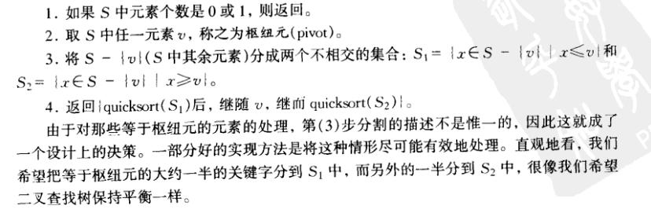
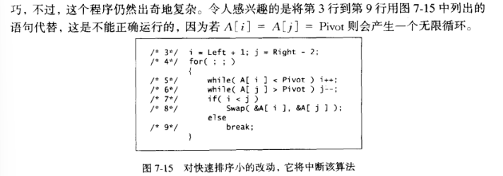

# 第7章 - 排序

默认为非递减有序（递增或相等）

## 插入排序

### 1.简单算法

- N-1 趟（pass）
- P = 1 到 P = N - 1 趟：
  - 0 --- P - 1的元素已排好序
  - 将位置P上的元素左移，使前P+1个元素（0-P）为已排序状态
- P元素 存于 Temp中，左边所有更大的元素依次右移一位
- 然后temp被置于合适的位置上

```c
void InsertSort(ElemtType A[],int N)//待排序数组与元素个数
{
    int j,P;
    //j代表插入位置
    //暂存待排序元素
    ElemtType temp;
    for(P=1;P<N;P++){
        temp = P;
        //依次比较位置P前面的各个元素
        //当该元素大于待排序值时，右移
        for(j = P;j>0;j--){
            if(A[j-1]>temp)
                A[j] = A[j-1];
            else
                //当出现第一个不大于该值的值的时候，退出，已记录该时刻的位置
                break;
        }
        A[j] = temp;
    }    
}
```


### 2.改进 - 希尔排序

- 比较一定间隔的元素
- 距离随算法的进行而减小
  - 缩小增量排序
- 增量序列 increment sequence h1.......ht
  - 流行但不好的增量序列：ht = N/2,hk = hk+1/2(下取整)
- hk-排序
  - hk-排序性将会保持
  - 对子数组进行插入排序

```c
void ShellSort(ElemtType A[],int N){
    int i,j,increment;
    ElemtType temp;
    
    //按照递增序列，每次 对 有一定间隔的元素 的 子数组 进行插入排序
    for(increment = N/2;increment > 0;increment /= 2){
        //每趟插入排序都是与前面的比较，下标小于increment的元素 没有 与他距离increment 且 在他前面的 元素，故从increment开始
        for(int i = increment;i < N;i++){
            temp = A[i];
            //j表示应插入位置，j不断左移，当j-1（此处的1指的是子数组中的1）指向的元素更大时，左移，并将j移动到该位置
            for(j = i;j >= increment;j--){
                if(A[j-increment] > temp)
                    A[j] = A[j- increment];
                else
                    break;
            }
            A[j] = temp;
       }
               
    }   
}
```


## 交换排序

### 1.冒泡排序

### 2.快速排序

- 平均运行时间：O(NlogN)
- 最坏情况：O(N²)，可避免
  - 潜在的隐患：划分的两个子数组大小不一定相同
- 分治/递归
- 比归并排序快：第三步划分虽然花费线性时间，但是在适当的位置进行并且非常有效



#### 2.1选取枢纽元

##### 错误的方法

用第一个元素作为枢纽元/前两个互异元素中的较大者作为枢纽元

1. 预排序或者反序的--劣质分割---二次时间但什么都没干
2. 预排序输入很常见

##### 安全的方法

随机选取

- 随机数的生成成本高（时间复杂度高，空间复杂度高）
- 无法减少平均运行时间

##### 最好的选择

三数中值分割法

一般的做法：使用左端、右端、中心位置三个元素的中位数作为枢纽元


#### 2.2分割策略

##### 元素互异

1. 枢纽元与最后一个元素交换
2. 双指针：i指向第一个元素，j指向倒数第二个元素
3. 将更小的元素移动到数组左边，将更大的元素移动到数组的右边
   1. i右移，j左移
   2. 当i指向一个大元素时停下，当j指向小元素时停下
   3. i，j不相交，元素互换，继续移动
   4. i，j相交，将i指向的元素与枢纽元交换
      -  保证枢纽元左边元素更小，右边元素更大

##### 存在等于枢纽元的关键字

如果i和j遇到等于枢纽元的关键字，都停止并进行交换

#### 2.3小数组

不适合快速排序

可以使用插入排序


#### 2.4快速排序例程

```c
/* Return median of Left, Center, and Right */
/* Order these and hide the pivot */
ElementType Median3( ElementType A[ ], int Left, int Right )
{
    int Center = ( Left + Right ) / 2;
    
    if( A[ Left ] > A[ Center ] )
        Swap( &A[ Left ], &A[ Center ] );
    if( A[ Left ] > A[ Right ] )
        Swap( &A[ Left ], &A[ Right ] );
    if( A[ Center ] > A[ Right ])
        Swap( &A[ Center ], &A [Right] );

    /* Invariant: A[ Left ] <= A [Center] <= A [Right] */

    Swap(&A [Center], &A [Right - 1]); /* Hide pivot */
    return A [Right - 1]; /* Return pivot */
}


#define Cutoff ( 3 )

void Qsort( ElementType A[ ], int Left, int Right )
{
    int i, j;
    ElementType Pivot;
	
    //数组足够大，可以使用快速排序
    if( Left + Cutoff <= Right )
    {
        Pivot = Median3( A, Left, Right );
        i = Left; j = Right - 1;
        for( ; ; )
        {
            //移动i，j指针
            while( A[ ++i ] < Pivot ){ }
            //i自增，直到遇到A[i] >= Pivot,跳出循环，此时i指向的元素为更大的元素
            //换成i++不可：当遇到 A[i]>= Pivot的时候，i又后移了一位，使得退出循环后的i不指向该大元素
            while( A[ --j ] > Pivot ){ }//j--也可
            if( i < j )
                Swap( &A[ i ], &A[ j ] );
            else
                break;
        }
        Swap( &A[ i ], &A[ Right - 1 ] );  /* Restore pivot */

        Qsort( A, Left, i - 1 );
        Qsort( A, i + 1, Right );
    }
    else  /* Do an insertion sort on the subarray */
        InsertionSort(A + Left, Right - Left + 1);
}


```

- 另外一种错误：



## 选择排序

### 1.简单选择排序

### 2.堆排序


## 归并排序

- 最坏情形O（NlogN）
- 递归/分治策略
- 合并两个已排序的表

```c

//最后的结果存储在A中，在归并的过程中，TempArray作为缓存位置，暂时存放merge后的数组
void MSort(ElemtType A[],ElemtType TempArray[],int Left,int Right)
{
    int Center;
    if(Left < Right) {

        Center = (Left+Right)/2;
        //归并排序左半边和右半边
        MSort(A, TempArray, Left, Center);
        MSort(A, TempArray, Center+1, Right);
        //将两个半的有序数组归并
        Merge(A, TempArray, Left, Center + 1, Right);
    }   
}

//merge sort 的启动程序
void MergeSort(ElemtType A[],int N){
    ElemtType* TempArray = (ElemtType*)malloc( N*sizeof(ElemtType) );
    MSort(A,TempArray,0,N-1);
    free(TempArray);   
}

//Merge函数：
//这个函数的主要目的是将两个已排序的子数组A[Lpos, Rpos-1]和A[Rpos, RightEnd]合并成一个有序的大数组，并将结果存储在A中。在归并的过程中，它使用了一个临时数组TmpArray来存储中间结果
void Merge( ElementType A[ ], ElementType TmpArray[ ],
            int Lpos, int Rpos, int RightEnd )
{
    int i, LeftEnd, NumElements, TmpPos;

    // 计算左子数组的结束位置
    LeftEnd = Rpos - 1;
    // 临时数组的起始位置
    TmpPos = Lpos;
    // 待合并的元素总数
    NumElements = RightEnd - Lpos + 1;

    /* 主循环 */
    while( Lpos <= LeftEnd && Rpos <= RightEnd )
        // 比较左右两个子数组的元素，将较小的元素放入临时数组
        if( A[ Lpos ] <= A[ Rpos ] )
            TmpArray[ TmpPos++ ] = A[ Lpos++ ];
        else
            TmpArray[ TmpPos++ ] = A[ Rpos++ ];

    // 将左子数组中剩余的元素复制到临时数组
    while( Lpos <= LeftEnd )
        TmpArray[ TmpPos++ ] = A[ Lpos++ ];

    // 将右子数组中剩余的元素复制到临时数组
    while( Rpos <= RightEnd )
        TmpArray[ TmpPos++ ] = A[ Rpos++ ];

    /* 将临时数组的内容复制回原数组 */
    for( i = 0; i < NumElements; i++, RightEnd-- )
        A[ RightEnd ] = TmpArray[ RightEnd ];
}


```

- TempArray数组只有一个
  - 若在merge中声明局部变量TempArray，空间复杂度高
  - 若用malloc和free动态分配内存，时间复杂度高，因为对内存的操作耗费时间
  - 不会发生内存访问冲突，因为merge函数在最后，同一时间只有一个merge函数调用，只有一个函数访问TempArray内存空间


## 间接排序

## 外部排序

